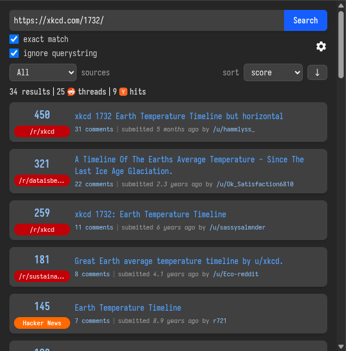

# Find On - Reddit + Hacker News
Chrome **and** Firefox extension that searches for discussions of the current URL on Reddit and Hacker News.

## Download
  - Google Webstore:
  - Microsoft Edge Webstore:
  - Firefox Add-Ons:

## Features
  - search for the URL of the current tab (automatically or when clicked)
  - find related discussion threads on both Reddit **and** Hacker News
  - option to ignore URL's query-string
  - special handling of YouTube video links: search by video ID to match all variations of YouTube links

## Changes from the original & fork
- Replaced JQuery, Bootstrap, and Handlebars with SolidJS and TailwindCSS
  - the reimplementation is about 50% smaller in size compared to the original
- Add support for Firefox
  - Previously this was not possible as Firefox does not support the Sandbox entrypoint the extension took advantage of for templating
- Integrate [WXT](https://wxt.dev) to speed up dev and improve DX
- Convert JS to TS and simplify some logic to improve clarity or extra work
- Fetch Reddit and Hacker News posts simultaneously
- Instead of local storage and clearing on startup, instead use Browser API session storage which handles this automatically

## Motivations
I am primarily a Firefox user and previously was using the following entirely seperate extension with the identical name [Find on Reddit](https://github.com/tijmenvanegmond/find-on-reddit) which was available on Firefox. However recently when I used it, it caused my browser to crash and after a brief unsuccessful attempt at debugging it, I looked for alternatives. I came across [@AdeelH](https://github.com/AdeelH)'s addon, noticed the issue about Firefox was stale and took a cursory glance to see if there were any forks. Coincidently, [@JeffreyCA](https://github.com/JeffreyCA) had only forked it a week prior, to integrate of Hacker News as a search target. This motivated me enough to see if I could somehow port it to Firefox, but I soon realized that [Sandbox](https://developer.chrome.com/docs/extensions/reference/manifest/sandbox) is not supported by Firefox and due to my unfamiliarity with the original implementation's technologies, I decided I would to refactor it while learning SolidJS for the first time. I also took the opportunity to tidy up some logic and move to TypeScript.

## Screenshots

## Credits

This project is a fork of [AdeelH/find-on-reddit](https://github.com/AdeelH/find-on-reddit) & [JeffreyCA/find-on](https://github.com/JeffreyCA/find-on).

All credit due to them for the original implementation and the following addition of Hacker News respectively.
